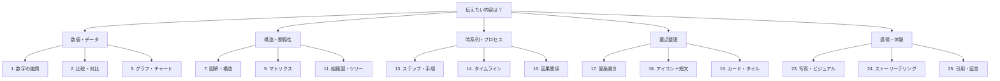

# ドラフトを「どう見せるか」完全ガイド

> **この資料を見れば、ドラフトをどう見せるかがわかる決定版**

## 🎯 見せ方選択の基本思考

### **選択の3ステップ**
1. **伝えたい内容の種類を特定**
2. **聞き手への影響目標を設定**
3. **最適な見せ方パターンを選択**

---

## 📊 全25パターン完全一覧

### **A. 数値・データ系（6パターン）**

| No | 見せ方パターン | 使用場面 | 効果・メリット | Marp実装例 |
|---|---|---|---|---|
| 1 | **数字の強調** | 売上・達成率などを強く印象付けたい | 視線を集め、記憶に残る。メッセージ性が高い | `<span style="font-size: 48px; color: #ff6b6b;">150億円</span>` |
| 2 | **比較（対比）** | A/B、前年比、競合比較など | 違いが明確になり、優位性を伝えやすい | 左右分割レイアウト `<!-- _class: split-layout -->` |
| 3 | **グラフ・チャート** | 数値変化・比率・推移を伝えたいとき | データを直感的に理解できる | `` |
| 4 | **ダッシュボード風** | 複数の重要指標を一覧表示 | 全体状況を瞬時に把握できる | グリッドレイアウト + アイコン |
| 5 | **進捗バー** | 達成度や進行状況を表現 | 視覚的に進捗が分かりやすい | CSS progressバー |
| 6 | **ランキング表示** | 順位や重要度を示したいとき | 相対的価値が明確になる | 番号付きリスト + 強調 |

### **B. 構造・関係性系（6パターン）**

| No | 見せ方パターン | 使用場面 | 効果・メリット | Marp実装例 |
|---|---|---|---|---|
| 7 | **図解（構造・関係）** | 全体像や関係性を説明したいとき | 抽象的な概念を具体化し、全体像が掴みやすい | Mermaid図 + 説明 |
| 8 | **ピラミッド構造** | 階層や重要度を表現 | 優先順位や構造が直感的に理解できる | CSS三角形 + 階層テキスト |
| 9 | **マトリクス（2軸図）** | 優先度や分類を整理したいとき | 客観的に評価でき、戦略マップなどに有効 | 4象限表 |
| 10 | **ネットワーク図** | 相互関係や影響を示す | 複雑な関係性を整理できる | ノード + エッジの図解 |
| 11 | **組織図・ツリー** | 階層構造や分類を表現 | 責任や分類が明確になる | 縦型・横型ツリー図 |
| 12 | **フロー・プロセス図** | 業務フローや判断過程 | 手順や判断基準が明確になる | 矢印 + ボックス図 |

### **C. 時系列・フロー系（4パターン）**

| No | 見せ方パターン | 使用場面 | 効果・メリット | Marp実装例 |
|---|---|---|---|---|
| 13 | **ステップ（手順・流れ）** | フロー説明、計画の段階を伝えるとき | 理解しやすく、実行に移しやすい | 番号付きステップ + 矢印 |
| 14 | **タイムライン（時系列）** | 過去〜現在〜未来の説明 | ストーリーや経過を理解しやすくなる | 横軸時間軸 + マイルストーン |
| 15 | **因果関係（フロー）** | 原因→結果の論理を示したいとき | 納得感のある説明ができる | 矢印 + 因果ボックス |
| 16 | **ロードマップ** | 長期計画や戦略的方向性 | 将来ビジョンが具体化される | 時間軸 + マイルストーン + 目標 |

### **D. 情報整理・構成系（6パターン）**

| No | 見せ方パターン | 使用場面 | 効果・メリット | Marp実装例 |
|---|---|---|---|---|
| 17 | **箇条書き（バレット）** | 要点を並べたいとき | 情報を整理して簡潔に伝えられる | `- ` + 適切な階層 |
| 18 | **アイコン＋短文** | 概念や要素を分かりやすく伝えたいとき | 直感的に伝わり、読みやすくなる | 絵文字 + 簡潔テキスト |
| 19 | **カード・タイル型** | 複数の要素を整理して表示 | 情報がモジュール化され理解しやすい | グリッドレイアウト + ボックス |
| 20 | **チェックリスト** | 確認事項や要件を示す | 行動に移しやすく、抜け漏れを防げる | `- [ ]` + 具体的項目 |
| 21 | **FAQ形式** | よくある質問や疑問に答える | 聞き手の疑問を先回りして解決 | Q&A形式 |
| 22 | **テーブル・一覧表** | 複数項目の比較や整理 | 情報を体系的に整理できる | Markdown表 |

### **E. 感情・体験系（3パターン）**

| No | 見せ方パターン | 使用場面 | 効果・メリット | Marp実装例 |
|---|---|---|---|---|
| 23 | **写真・ビジュアル** | 実物や雰囲気を伝えたいとき | 信頼性や現実感、感情訴求に優れる | `` + オーバーレイ |
| 24 | **ストーリーテリング構成** | 成功事例やプロジェクトの流れ | 感情に訴え、共感を得やすい | 起承転結 + 実例 |
| 25 | **引用・証言** | 権威性や信頼性を示したい | 第三者の声で説得力が増す | 引用ボックス + 出典 |

---

## 🎨 具体的なMarp実装方法

### **1. 数字の強調**
```markdown
<!-- _style: "text-align: center;" -->
## 2024年度売上実績

<div style="font-size: 72px; color: #ff6b6b; font-weight: bold; margin: 50px 0;">
150億円
</div>

<div style="font-size: 24px; color: #666;">
前年比 <span style="color: #4ecdc4; font-size: 32px;">+25%</span> 達成
</div>
```

### **2. 比較（対比）**
```markdown
<!-- _class: split-layout -->
## A社 vs B社 比較

<div class="content-container">

<div class="split-left">

### A社（従来手法）
- コスト: **500万円**
- 期間: **6ヶ月**
- 品質: **70%**
- リスク: **高**

</div>

<div class="split-right">

### B社（新手法）
- コスト: **300万円**
- 期間: **3ヶ月**
- 品質: **95%**
- リスク: **低**

</div>

</div>
```

### **3. ステップ（手順・流れ）**
```markdown
## プロジェクト実行ステップ

<div style="display: flex; justify-content: space-between; align-items: center; margin: 40px 0;">

<div style="text-align: center; flex: 1;">
<div style="background: #4ecdc4; color: white; border-radius: 50%; width: 60px; height: 60px; line-height: 60px; margin: 0 auto;">1</div>
<h3>要件定義</h3>
<p>2週間</p>
</div>

<div style="font-size: 30px; color: #999;">→</div>

<div style="text-align: center; flex: 1;">
<div style="background: #ff6b6b; color: white; border-radius: 50%; width: 60px; height: 60px; line-height: 60px; margin: 0 auto;">2</div>
<h3>設計・開発</h3>
<p>8週間</p>
</div>

<div style="font-size: 30px; color: #999;">→</div>

<div style="text-align: center; flex: 1;">
<div style="background: #f39800; color: white; border-radius: 50%; width: 60px; height: 60px; line-height: 60px; margin: 0 auto;">3</div>
<h3>テスト・納品</h3>
<p>2週間</p>
</div>

</div>
```

### **4. マトリクス（2軸図）**
```markdown
## 優先度マトリクス

<div style="position: relative; width: 500px; height: 400px; margin: 50px auto; border-left: 3px solid #333; border-bottom: 3px solid #333;">

<!-- Y軸ラベル -->
<div style="position: absolute; left: -80px; top: 50%; transform: rotate(-90deg); font-weight: bold;">重要度</div>

<!-- X軸ラベル -->
<div style="position: absolute; bottom: -40px; left: 50%; transform: translateX(-50%); font-weight: bold;">緊急度</div>

<!-- 第1象限 -->
<div style="position: absolute; top: 20px; right: 20px; background: #ff6b6b; color: white; padding: 10px; border-radius: 5px;">
<strong>A. 緊急かつ重要</strong><br>
システム障害対応
</div>

<!-- 第2象限 -->
<div style="position: absolute; top: 20px; left: 20px; background: #4ecdc4; color: white; padding: 10px; border-radius: 5px;">
<strong>B. 重要だが緊急でない</strong><br>
戦略的プロジェクト
</div>

<!-- 第3象限 -->
<div style="position: absolute; bottom: 20px; left: 20px; background: #ffd93d; color: black; padding: 10px; border-radius: 5px;">
<strong>C. 緊急だが重要でない</strong><br>
定期報告書作成
</div>

<!-- 第4象限 -->
<div style="position: absolute; bottom: 20px; right: 20px; background: #ccc; color: black; padding: 10px; border-radius: 5px;">
<strong>D. 緊急でも重要でもない</strong><br>
雑務
</div>

</div>
```

### **5. タイムライン（時系列）**
```markdown
## プロジェクトタイムライン

<div style="position: relative; margin: 50px 0;">

<!-- タイムライン軸 -->
<div style="height: 4px; background: #ddd; margin: 20px 0; position: relative;">

<!-- マイルストーン1 -->
<div style="position: absolute; left: 20%; top: -8px; width: 20px; height: 20px; background: #4ecdc4; border-radius: 50%;"></div>
<div style="position: absolute; left: 20%; top: 30px; text-align: center; transform: translateX(-50%);">
<strong>2024年1月</strong><br>
プロジェクト開始
</div>

<!-- マイルストーン2 -->
<div style="position: absolute; left: 50%; top: -8px; width: 20px; height: 20px; background: #ff6b6b; border-radius: 50%;"></div>
<div style="position: absolute; left: 50%; top: 30px; text-align: center; transform: translateX(-50%);">
<strong>2024年6月</strong><br>
β版リリース
</div>

<!-- マイルストーン3 -->
<div style="position: absolute; left: 80%; top: -8px; width: 20px; height: 20px; background: #f39800; border-radius: 50%;"></div>
<div style="position: absolute; left: 80%; top: 30px; text-align: center; transform: translateX(-50%);">
<strong>2024年12月</strong><br>
正式リリース
</div>

</div>
</div>
```

### **6. アイコン＋短文**
```markdown
## サービスの3つの特徴

<div style="display: flex; justify-content: space-around; margin: 40px 0;">

<div style="text-align: center; flex: 1;">
<div style="font-size: 64px;">🚀</div>
<h3>高速処理</h3>
<p>従来比3倍の処理速度</p>
</div>

<div style="text-align: center; flex: 1;">
<div style="font-size: 64px;">🔒</div>
<h3>高セキュリティ</h3>
<p>金融業界標準の暗号化</p>
</div>

<div style="text-align: center; flex: 1;">
<div style="font-size: 64px;">💰</div>
<h3>コスト削減</h3>
<p>運用コスト50%削減</p>
</div>

</div>
```

---

## 🎯 見せ方選択フローチャート



---

## 📋 見せ方決定チェックリスト

### **Step 1: 内容分析**
- [ ] 数値データが中心か？
- [ ] 関係性や構造を説明するか？
- [ ] 時系列や手順を示すか？
- [ ] 複数の要点を整理するか？
- [ ] 感情や体験を伝えるか？

### **Step 2: 聞き手分析**
- [ ] 技術的詳細が必要か？
- [ ] 感情的説得が重要か？
- [ ] 論理的説明が求められるか？
- [ ] 視覚的理解が優先か？

### **Step 3: 効果検証**
- [ ] 選んだ見せ方で伝わるか？
- [ ] Marpで実装可能か？
- [ ] 時間内で作成できるか？
- [ ] 聞き手にとって価値があるか？

---

## 🏆 効果的な見せ方の組み合わせパターン

### **データ重視プレゼン**
1. **数字の強調** → **グラフ・チャート** → **比較・対比**

### **戦略説明プレゼン**
1. **現状分析（マトリクス）** → **ロードマップ** → **期待効果（数字強調）**

### **プロセス説明プレゼン**
1. **全体像（図解）** → **ステップ・手順** → **成果イメージ（ビジュアル）**

### **成果報告プレゼン**
1. **ストーリーテリング** → **数字の強調** → **次のアクション（チェックリスト）**

---

**この完全ガイドにより、どんなドラフトでも最適な「見せ方」を選択し、効果的なプレゼンテーションに変換できます！** 🎯