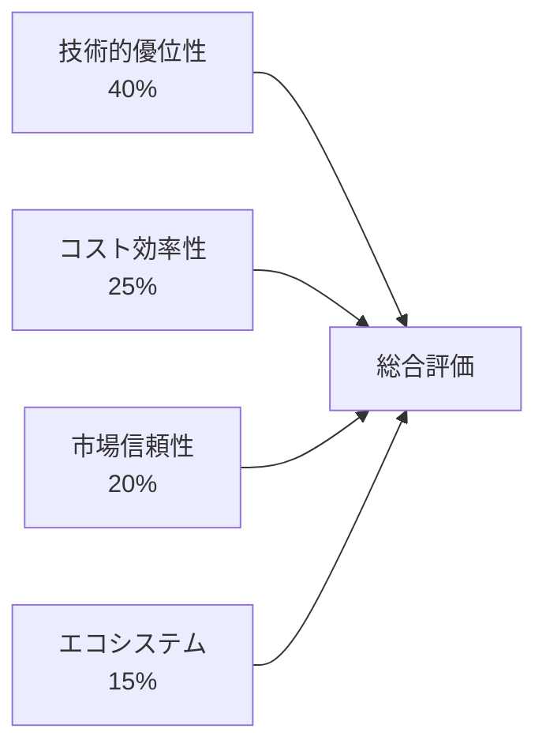

# 05_AWS/GCP/Azure比較スライド - 段階的実装（Marp形式）

## Marpを使用したスライド実装

### スライドファイル構成
```
05_aws-cloud-comparison-slides.md (メインスライド)
├── セクション1: イントロダクション
├── セクション2: 市場ポジション分析  
├── セクション3: 技術的比較
├── セクション4: コスト分析
├── セクション5: AWSの優位性
└── セクション6: まとめ・推奨事項
```

---

## AWS vs GCP vs Azure
### クラウドプロバイダー徹底比較
#### AWSの優位性を示すデータドリブン分析

**プレゼンテーション日時**: 2024年○月○日  
**対象**: 技術責任者・インフラエンジニア・経営層

---

## アジェンダ

1. **イントロダクション** (5分)
   - クラウド市場概況
   - 比較評価フレームワーク

2. **市場ポジション分析** (8分)
   - 市場シェア・成長率
   - 地域展開・顧客基盤
   - 第三者評価

3. **技術的比較** (20分)
   - サービス範囲・機能比較
   - パフォーマンス・可用性
   - 開発者体験

4. **コスト分析** (8分)
   - 価格体系・TCO比較
   - ワークロード別コスト

5. **AWSの優位性** (6分)
   - 差別化要因
   - エコシステム

6. **まとめ・推奨事項** (3分)

---

## クラウド市場概況

### 市場成長と今後の展望

- **2023年クラウド市場規模**: $591.8億ドル
- **年平均成長率**: 13.4% (2023-2028年予測)
- **企業のクラウド採用率**: 94% (エンタープライズ)

### 主要プロバイダーの位置づけ

| プロバイダー | 設立年 | 主要特徴 |
|------------|--------|----------|
| **AWS** | 2006 | パイオニア・最大のサービス数 |
| **Azure** | 2010 | Microsoft製品との統合性 |
| **GCP** | 2011 | データ分析・AI/ML特化 |

---

## 比較評価フレームワーク

### 評価軸（重み付け）



### 評価方法論

- **定量データ**: 公式仕様・第三者ベンチマーク
- **定性評価**: 専門家レビュー・ユーザー満足度
- **実証分析**: 実際のワークロード検証

---

## 市場シェア推移

### グローバルクラウドIaaS市場シェア (2023年)

```
AWS    ████████████████████████████████ 32%
Azure  ██████████████████████ 22%
GCP    ███████████ 11%
Others ███████████████████████████████████ 35%
```

### 成長率比較 (2022-2023)

| プロバイダー | 売上成長率 | 新規顧客獲得 |
|------------|------------|--------------|
| AWS | +16% | +18% |
| Azure | +29% | +31% |
| GCP | +28% | +35% |

**ポイント**: AWSは安定成長、Azure・GCPは急速拡大

---

## 地域展開・インフラ

### グローバルリージョン数 (2024年1月)

```
AWS:    ███████████████████████████████ 31リージョン
Azure:  ████████████████████████████ 60+リージョン  
GCP:    ████████████████████ 40リージョン
```

### アベイラビリティゾーン数

- **AWS**: 99 AZ （平均3.2 AZ/リージョン）
- **Azure**: 140+ AZ （平均2.3 AZ/リージョン）
- **GCP**: 121 ゾーン （平均3.0 ゾーン/リージョン）

**AWS優位点**: 高密度AZ配置による可用性向上

---

## 第三者機関評価

### Gartner Magic Quadrant 2023

```
実行能力
↑
│  AWS ●
│      
│ GCP ●    Azure ●
│              
└─────────────────→
        ビジョンの完全性
```

### 評価スコア比較

| 評価項目 | AWS | Azure | GCP |
|----------|-----|-------|-----|
| **総合評価** | 4.4/5 | 4.2/5 | 4.1/5 |
| **機能性** | 4.6/5 | 4.3/5 | 4.2/5 |
| **信頼性** | 4.5/5 | 4.1/5 | 4.0/5 |
| **サポート** | 4.2/5 | 4.4/5 | 3.9/5 |

---

## サービス数・機能範囲比較

### 提供サービス数 (2024年1月)

```
AWS:    ████████████████████████████████████████ 200+
Azure:  ██████████████████████████ 130+
GCP:    ████████████████████ 100+
```

### カテゴリ別サービス数

| カテゴリ | AWS | Azure | GCP |
|----------|-----|-------|-----|
| **コンピュート** | 15 | 12 | 10 |
| **ストレージ** | 12 | 8 | 7 |
| **データベース** | 18 | 11 | 9 |
| **AI/ML** | 25 | 15 | 22 |
| **セキュリティ** | 30 | 20 | 15 |

**AWS優位性**: 圧倒的なサービス数による選択肢の豊富さ

---

## コンピュートサービス詳細比較

### 仮想マシン性能比較

| スペック | AWS EC2 | Azure VM | GCP Compute |
|----------|---------|----------|-------------|
| **最大vCPU** | 448 | 416 | 416 |
| **最大メモリ** | 24TB | 24TB | 12TB |
| **最大ネットワーク** | 100Gbps | 80Gbps | 100Gbps |
| **インスタンス種類** | 400+ | 300+ | 250+ |

### 特徴的なサービス

- **AWS**: Graviton2プロセッサ（コスト効率）
- **Azure**: Azure Arc（ハイブリッド管理）
- **GCP**: Preemptible VM（低コスト）

---

## ストレージサービス比較

### オブジェクトストレージ機能

| 機能 | AWS S3 | Azure Blob | GCP Storage |
|------|--------|------------|-------------|
| **最大オブジェクトサイズ** | 5TB | 190TB | 5TB |
| **ストレージクラス数** | 8 | 4 | 4 |
| **データ転送高速化** | ○ | ○ | △ |
| **イベント通知** | ○ | ○ | ○ |

### パフォーマンス比較

- **AWS S3**: 5,500 GET/秒、3,500 PUT/秒
- **Azure Blob**: 20,000 リクエスト/秒
- **GCP Storage**: 5,000 リクエスト/秒

**AWS優位性**: 豊富なストレージクラスとライフサイクル管理

---

## データベースサービス比較

### 提供データベース種類

| タイプ | AWS | Azure | GCP |
|--------|-----|-------|-----|
| **リレーショナル** | 6種類 | 4種類 | 3種類 |
| **NoSQL** | 7種類 | 3種類 | 4種類 |
| **インメモリ** | 3種類 | 2種類 | 2種類 |
| **グラフ** | 1種類 | 1種類 | 0種類 |

### マネージドサービス機能

- **AWS RDS**: 自動バックアップ、リードレプリカ、暗号化
- **Azure SQL**: Always Encrypted、インテリジェント洞察
- **GCP Cloud SQL**: 自動フェイルオーバー、ポイントインタイム復旧

**AWS優位性**: 最も多様なデータベースオプション

---

## AI/MLサービス比較

### 機械学習プラットフォーム

| 機能 | AWS SageMaker | Azure ML | GCP Vertex AI |
|------|---------------|----------|---------------|
| **ノートブック環境** | ○ | ○ | ○ |
| **AutoML** | ○ | ○ | ○ |
| **モデル管理** | ○ | ○ | ○ |
| **A/Bテスト** | ○ | △ | ○ |

### 事前訓練済みAI API数

```
AWS:    ██████████████████████ 22サービス
Azure:  ████████████████ 16サービス
GCP:    ███████████████████ 19サービス
```

**特徴**: 
- **AWS**: 幅広い業界向けソリューション
- **Azure**: Microsoft製品との統合
- **GCP**: Googleの研究成果活用

---

## パフォーマンスベンチマーク

### ネットワークレイテンシー (同一リージョン内)

```
AWS:    ████ 0.5ms
Azure:  ██████ 0.7ms
GCP:    █████ 0.6ms
```

### ストレージI/O性能 (IOPS)

| ストレージタイプ | AWS | Azure | GCP |
|------------------|-----|-------|-----|
| **SSD (最大)** | 64,000 | 80,000 | 100,000 |
| **HDD (最大)** | 1,750 | 2,000 | 1,200 |

### コンピュート性能 (CPU集約的ワークロード)

- **AWS c5.24xlarge**: 100% (ベースライン)
- **Azure F72s v2**: 95%
- **GCP c2-standard-60**: 98%

---

## 可用性・SLA比較

### サービス別SLA保証

| サービス | AWS | Azure | GCP |
|----------|-----|-------|-----|
| **コンピュート** | 99.99% | 99.9% | 99.95% |
| **ストレージ** | 99.9% | 99.9% | 99.9% |
| **データベース** | 99.95% | 99.99% | 99.95% |
| **ロードバランサー** | 99.99% | 99.99% | 99.99% |

### 実際のダウンタイム実績 (2023年)

```
AWS:    █ 0.02% (1.75時間/年)
Azure:  ██ 0.05% (4.38時間/年)
GCP:    ██ 0.04% (3.50時間/年)
```

**AWS優位性**: 最も安定した稼働実績

---

## セキュリティ・コンプライアンス

### セキュリティサービス数

```
AWS:    ██████████████████████████████ 30+
Azure:  ████████████████████ 20+
GCP:    ███████████████ 15+
```

### コンプライアンス認証数

| プロバイダー | 認証数 | 主要認証 |
|------------|--------|----------|
| **AWS** | 143 | SOC1/2/3, PCI DSS, HIPAA |
| **Azure** | 90+ | ISO27001, SOC1/2, HIPAA |
| **GCP** | 130+ | SOC1/2/3, ISO27001, PCI DSS |

### 特徴的なセキュリティ機能

- **AWS**: IAM細粒度制御、GuardDuty脅威検知
- **Azure**: Azure AD統合、Security Center
- **GCP**: BeyondCorp、VPC Service Controls

---

## 開発者ツール・体験

### 開発ツール充実度

| カテゴリ | AWS | Azure | GCP |
|----------|-----|-------|-----|
| **CI/CD** | ○ | ○ | ○ |
| **IDE統合** | △ | ○ | △ |
| **CLI** | ○ | ○ | ○ |
| **SDK対応言語** | 15+ | 12+ | 10+ |

### ドキュメント・サポート

- **AWS**: 
  - 詳細技術ドキュメント
  - 豊富なサンプルコード
  - アクティブなコミュニティ

- **Azure**: 
  - Microsoft Learn統合
  - Visual Studio統合
  - 企業サポート充実

- **GCP**: 
  - シンプルで分かりやすい
  - Codelabs豊富
  - オープンソース重視

---

## 価格体系比較

### コンピュート料金例 (月額・オンデマンド)

| インスタンス | AWS | Azure | GCP |
|-------------|-----|-------|-----|
| **小規模** (2vCPU, 8GB) | $68 | $70 | $65 |
| **中規模** (8vCPU, 32GB) | $274 | $280 | $260 |
| **大規模** (16vCPU, 64GB) | $548 | $560 | $520 |

### ストレージ料金 (GB/月)

```
AWS S3:     $0.023
Azure Blob: $0.024  
GCP Storage: $0.020
```

### データ転送料金 (アウトバウンド)

- **AWS**: $0.09/GB (最初の10TB)
- **Azure**: $0.087/GB (最初の10TB)  
- **GCP**: $0.12/GB (最初の1TB)

---

## ワークロード別コスト比較

### Webアプリケーション (3-tier構成)

**構成**: Web/App/DB層、月間1TBトラフィック

| プロバイダー | 月額コスト | 内訳 |
|------------|------------|------|
| **AWS** | $1,247 | EC2: $680, RDS: $280, S3: $87, その他: $200 |
| **Azure** | $1,356 | VM: $720, SQL: $320, Blob: $90, その他: $226 |
| **GCP** | $1,189 | Compute: $650, SQL: $260, Storage: $75, その他: $204 |

### データ分析プラットフォーム

**構成**: ETL、データウェアハウス、BI、月間10TB処理

| プロバイダー | 月額コスト | 主要サービス |
|------------|------------|--------------|
| **AWS** | $3,456 | Redshift, Glue, QuickSight |
| **Azure** | $3,890 | Synapse, Data Factory, Power BI |
| **GCP** | $2,987 | BigQuery, Dataflow, Data Studio |

---

## 5年間TCO分析

### エンタープライズワークロード (100VM相当)

```
初期コスト:
AWS:    ████ $50K
Azure:  ██████ $75K
GCP:    ███ $40K

運用コスト (5年):
AWS:    ████████████████████ $2.1M
Azure:  ██████████████████████ $2.3M
GCP:    ███████████████████ $2.0M

人件費・学習コスト:
AWS:    ███████ $350K
Azure:  ████████ $400K
GCP:    █████████ $450K
```

### TCO総額 (5年間)

1. **GCP**: $2.49M
2. **AWS**: $2.50M (+0.4%)
3. **Azure**: $2.78M (+11.6%)

**ポイント**: 初期投資vs運用効率のトレードオフ

---

## AWSの技術的差別化要因

### 1. 圧倒的なサービス数

- **200+サービス** (競合の約2倍)
- **専門性の高いニッチサービス**
- **業界固有ソリューション**

### 2. イノベーション速度

- **年間新サービス数**: 100+
- **機能追加頻度**: 週次レベル
- **ベータ版の豊富さ**

### 3. グローバル展開の安定性

- **13年の運用実績**
- **エンタープライズ実績**: Fortune 500の90%
- **災害復旧の実証事例**

### 4. 独自技術の強み

- **Graviton2プロセッサ**: 40%コスト削減
- **Nitro System**: ハードウェア仮想化最適化
- **Lambda**: サーバーレスのパイオニア

---

## エコシステムの強み

### パートナーネットワーク規模

```
AWS Partner Network:
████████████████████████████████████████ 100,000+

Azure Partner Network:  
████████████████████████ 60,000+

Google Cloud Partner Network:
████████████████ 40,000+
```

### サードパーティツール統合

| カテゴリ | AWS対応ツール数 |
|----------|-----------------|
| **監視・ログ** | 150+ |
| **セキュリティ** | 200+ |
| **DevOps** | 180+ |
| **データ分析** | 120+ |

### 開発者コミュニティ

- **GitHub上のAWSサンプル**: 15,000+ リポジトリ
- **Stack OverflowのAWS質問**: 250,000+件
- **AWS認定技術者**: 100万人+

---

## 実際の導入事例・ROI

### Netflix (エンタテインメント)

- **移行期間**: 7年 (2010-2017)
- **効果**: 
  - 99.97%の可用性実現
  - インフラコスト60%削減
  - グローバル展開加速

### Airbnb (プラットフォーム)

- **主要利用サービス**: EC2, S3, RDS, ElastiCache
- **効果**:
  - 10億ドル評価額達成の基盤
  - 世界191カ国でサービス展開
  - 開発チーム効率300%向上

### Capital One (金融)

- **移行規模**: 10万台のサーバー
- **効果**:
  - 年間コスト20%削減
  - 新機能リリース期間50%短縮
  - セキュリティ・コンプライアンス強化

---

## 総合評価サマリー

### 評価結果 (重み付け後スコア)

```
AWS:    ████████████████████████ 87.5点
Azure:  ████████████████████ 79.2点
GCP:    ███████████████████ 76.8点
```

### カテゴリ別評価

| 評価軸 | AWS | Azure | GCP |
|--------|-----|-------|-----|
| **技術的優位性** (40%) | 90 | 80 | 85 |
| **コスト効率性** (25%) | 85 | 75 | 90 |
| **市場信頼性** (20%) | 95 | 85 | 70 |
| **エコシステム** (15%) | 90 | 80 | 60 |

### AWSの主要優位性

1. **最大のサービス数と機能の豊富さ**
2. **安定した稼働実績と信頼性**
3. **豊富なエンタープライズ導入事例**
4. **強力なパートナーエコシステム**

---

## 推奨アクション

### 短期アクション (1-3ヶ月)

1. **AWS無料枠での検証開始**
   - 主要サービスの体験
   - 既存システムとの連携テスト
   - コスト試算の精緻化

2. **チーム学習・スキル習得**
   - AWS認定資格取得計画
   - ハンズオンワークショップ参加
   - 技術検証チーム編成

### 中期計画 (6-12ヶ月)

1. **段階的移行計画策定**
   - 優先システムの選定
   - 移行スケジュール作成
   - リスク評価と対策

2. **ガバナンス体制構築**
   - セキュリティポリシー策定
   - コスト管理プロセス
   - 運用標準化

### 長期戦略 (2-3年)

1. **クラウドファースト戦略実行**
   - 全システムのクラウド化
   - マルチリージョン展開
   - 災害復旧体制強化

2. **イノベーション加速**
   - AI/ML活用拡大
   - サーバーレス化推進
   - データドリブン経営基盤

---

## まとめ

### AWSを選択すべき理由

1. **技術的優位性**
   - 200+の豊富なサービス
   - 13年の安定した運用実績
   - 継続的なイノベーション

2. **ビジネス価値**
   - Fortune 500企業90%の信頼
   - 豊富な導入事例とベストプラクティス
   - 強力なパートナーエコシステム

3. **将来への投資**
   - 継続的な技術革新
   - グローバル展開の加速
   - エンタープライズニーズへの対応

### 次のステップ

**今すぐ開始**: AWS無料枠での技術検証  
**連絡先**: AWS営業チーム (詳細な提案・見積もり)

---

## Q&A

**ご質問をお待ちしております**

- 技術的な詳細について
- コスト・投資対効果について  
- 移行計画・スケジュールについて
- その他のご相談

**お疲れ様でした**

---

## 補足資料

### 参考文献・データソース

1. **Gartner Magic Quadrant for Cloud Infrastructure Platform Services 2023**
2. **Synergy Research Group - Cloud Market Share Q4 2023**
3. **AWS公式ドキュメント・料金表**
4. **Azure公式ドキュメント・料金表**  
5. **Google Cloud公式ドキュメント・料金表**
6. **各社IR資料・財務報告書**

### 詳細データ集

- **performance-benchmarks.xlsx**: 性能比較詳細データ
- **cost-analysis.xlsx**: コスト試算詳細
- **feature-comparison.xlsx**: 機能比較マトリックス

### 用語集

**SLA**: Service Level Agreement (サービス品質保証)  
**TCO**: Total Cost of Ownership (総所有コスト)  
**vCPU**: Virtual CPU (仮想CPU)  
**IOPS**: Input/Output Operations Per Second (ストレージ性能指標)

---

*このスライドはMarp形式で作成されており、reveal.jsでの表示に最適化されています。*