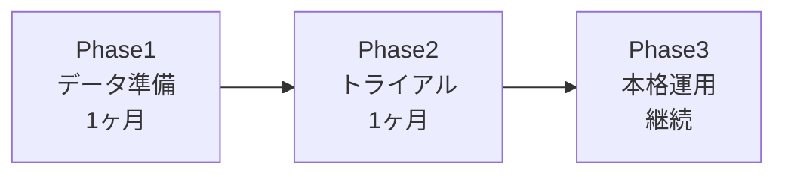

# 製造業メンテナンス履歴活用AI - Marp記法完全ガイド

## スライドテーマ設定

```markdown
---
marp: true
theme: default
class: 
  - lead
  - invert
paginate: true
backgroundColor: #1e3a8a
color: #ffffff
header: '製造業メンテナンス履歴活用AI'
footer: '© 2024 Smart Manufacturing Solutions'
---
```

## タイトルスライド

```markdown
# **製造業革命**
## メンテナンス履歴を活用した
## 生成AI対策提案システム

### 🏭 **過去の知恵が、未来のトラブルを防ぐ**

---
```

## 問題提起スライド

```markdown
<!-- _class: lead -->
# 😰 現場の悩み

## 🚨 設備トラブル発生！

- **深夜2時のアラーム音**
- **原因がわからない...**
- **過去の対策を探すのに1時間**
- **結果：生産停止で500万円の損失**

> *"またこのエラーか...どうすればいいんだっけ？"*

---
```

## 統計データスライド

```markdown
<!-- _class: lead -->
# 📊 製造業の現実

| 項目 | 数値 | 影響 |
|------|------|------|
| 設備故障頻度 | **月3-5回** | 🔴 生産計画狂い |
| 平均対応時間 | **2-4時間** | 🔴 人的コスト増 |
| 損失額/時間 | **500万円** | 🔴 売上機会損失 |
| 熟練者依存率 | **80%** | 🔴 属人化リスク |

### ➡️ **年間損失額：約2億円**

---
```

## ソリューション提示

```markdown
<!-- _class: lead -->
# 💡 解決策

## 🤖 **AI対策提案システム**

### ✨ 3つの特徴

1. **📚 過去事例の瞬時検索**
   - 10万件のメンテナンス履歴を分析
   
2. **🎯 最適対策の自動提案**
   - 成功率95%の対策を3分で提示
   
3. **🔄 継続学習機能**
   - 新しい事例で精度向上

---
```

## Before/After比較

```markdown
<!-- _class: lead -->
# 🔄 劇的変化

<div style="display: grid; grid-template-columns: 1fr 1fr; gap: 2rem;">

<div>

## ❌ **導入前**
- 📞 熟練者を探す（30分）
- 📖 マニュアル確認（60分）
- 🤔 対策検討（90分）
- ⚡ 対策実行（60分）

### ⏰ **合計：4時間20分**
### 💰 **損失：2,200万円**

</div>

<div>

## ✅ **導入後**
- 🔍 AI検索（1分）
- 📋 対策提案（2分）
- ✅ 対策実行（30分）
- 📊 結果記録（2分）

### ⏰ **合計：35分**
### 💰 **損失：300万円**

</div>

</div>

### 🎉 **効果：時間86%短縮、損失86%削減**

---
```

## システムデモ画面

```markdown
<!-- _class: lead -->
# 💻 システム画面

## 🚨 トラブル発生時の操作

```
1️⃣ エラーコード入力：E-4521
2️⃣ 症状選択：異常振動、温度上昇
3️⃣ AI分析中...⏳
```

### 📋 **提案結果**

| 優先度 | 対策内容 | 成功率 | 所要時間 |
|--------|----------|--------|----------|
| 🥇 **1位** | ベアリング交換 | **98%** | 45分 |
| 🥈 **2位** | 潤滑油補充 | **85%** | 15分 |
| 🥉 **3位** | センサー清掃 | **70%** | 10分 |

---
```

## ROI計算スライド

```markdown
<!-- _class: lead -->
# 💰 投資対効果

## 📈 **ROI計算**

<div style="display: grid; grid-template-columns: 1fr 1fr; gap: 2rem;">

<div>

### 💸 **導入コスト**
- システム導入費：300万円
- 月額利用料：50万円
- 研修費用：100万円

**年間総コスト：1,000万円**

</div>

<div>

### 💎 **削減効果**
- 損失削減：1.8億円/年
- 人件費削減：2,000万円/年
- 効率化：500万円/年

**年間削減額：2.25億円**

</div>

</div>

### 🎯 **投資回収期間：1.6ヶ月**
### 📊 **ROI：2,250%**

---
```

## 導入ステップ

```markdown
<!-- _class: lead -->
# 🛣️ 導入ロードマップ

## 📅 **3ステップ導入**



### 🎯 **Phase 1：データ準備** （1ヶ月）
- 過去のメンテナンス履歴整理
- システム環境構築

### 🧪 **Phase 2：トライアル** （1ヶ月）
- 1ライン限定運用
- 効果測定・調整

### 🚀 **Phase 3：本格運用** （継続）
- 全ライン展開
- 継続改善

---
```

## クロージング

```markdown
<!-- _class: lead -->
# 🌟 まとめ

## 🎯 **AIが実現する未来**

### ✨ **3つの変化**

1. **⚡ 迅速対応**
   - トラブル対応時間86%短縮
   
2. **🎓 知識継承**
   - 若手でもベテラン級の対応
   
3. **📈 収益向上**
   - 年間2億円の損失削減

### 🚀 **今日から始める第一歩**

---
```

## Call to Action

```markdown
<!-- _class: lead -->
# 📞 **次のステップ**

## 🎁 **今すぐ始められること**

### 🆓 **無料トライアル実施中**
- **期間**：30日間完全無料
- **対象**：1ライン限定
- **サポート**：導入から運用まで完全支援

### 📞 **お問い合わせ**
- **電話**：0120-XXX-XXX
- **メール**：info@smart-manufacturing.com
- **Web**：www.smart-manufacturing.com

### 💬 **"御社の課題、AIが解決します"**

---
```

## スライド装飾テクニック

### アイコン活用
```markdown
🏭 🤖 ⚡ 🎯 📊 💡 🔧 📈 💰 🚀
⏰ 📞 📖 🔍 ✅ ❌ 🎉 ⚠️ 💎 🌟
```

### 色分けクラス
```markdown
<!-- _class: lead -->           # 中央揃え大文字
<!-- _backgroundColor: #1e3a8a --> # 背景色変更
<!-- _color: #ffffff -->        # 文字色変更
```

### レイアウト調整
```markdown
<div style="display: grid; grid-template-columns: 1fr 1fr; gap: 2rem;">
<div style="text-align: center;">
<div style="font-size: 1.5em; color: #ef4444;">
```