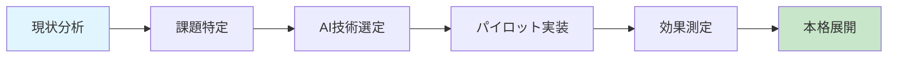

# 製造業における生成AI活用 - Marp記法完全ガイド

## 1. テーマとスタイル設定

### 製造業向けテーマ選択
```markdown
---
marp: true
theme: default
class: 
  - lead
backgroundImage: url('data:image/svg+xml;base64,PHN2ZyB3aWR0aD0iMTI4MCIgaGVpZ2h0PSI3MjAiIHZpZXdCb3g9IjAgMCAxMjgwIDcyMCIgZmlsbD0ibm9uZSIgeG1sbnM9Imh0dHA6Ly93d3cudzMub3JnLzIwMDAvc3ZnIj4KPGRlZnM+CjxsaW5lYXJHcmFkaWVudCBpZD0iZ3JhZGllbnQiIHgxPSIwJSIgeTE9IjAlIiB4Mj0iMTAwJSIgeTI9IjEwMCUiPgo8c3RvcCBvZmZzZXQ9IjAlIiBzdHlsZT0ic3RvcC1jb2xvcjojZjhmOWZhO3N0b3Atb3BhY2l0eToxIiAvPgo8c3RvcCBvZmZzZXQ9IjEwMCUiIHN0eWxlPSJzdG9wLWNvbG9yOiNlM2Y2ZmY7c3RvcC1vcGFjaXR5OjEiIC8+CjwvbGluZWFyR3JhZGllbnQ+CjwvZGVmcz4KPHJlY3Qgd2lkdGg9IjEyODAiIGhlaWdodD0iNzIwIiBmaWxsPSJ1cmwoI2dyYWRpZW50KSIvPgo8L3N2Zz4=')
paginate: true
header: '製造業における生成AI活用の最新動向'
footer: 'Confidential - Internal Use Only'
---
```

### カスタムCSS定義
```markdown
<style>
.manufacturing-theme {
  --primary-color: #1e40af;
  --secondary-color: #3b82f6;
  --accent-color: #fbbf24;
  --text-color: #1f2937;
  --background-light: #f8fafc;
}

.highlight-box {
  background: linear-gradient(135deg, #eff6ff 0%, #dbeafe 100%);
  border-left: 4px solid var(--primary-color);
  padding: 1rem;
  margin: 1rem 0;
  border-radius: 8px;
}

.stats-grid {
  display: grid;
  grid-template-columns: repeat(3, 1fr);
  gap: 2rem;
  margin: 2rem 0;
}

.stat-item {
  text-align: center;
  padding: 1.5rem;
  background: white;
  border-radius: 12px;
  box-shadow: 0 4px 6px -1px rgba(0, 0, 0, 0.1);
}

.stat-number {
  font-size: 3rem;
  font-weight: bold;
  color: var(--primary-color);
}

.stat-label {
  font-size: 1.1rem;
  color: var(--text-color);
  margin-top: 0.5rem;
}
</style>
```

## 2. タイトルスライドの効果的な作成

```markdown
---
class: manufacturing-theme lead

# 製造業における生成AI活用の最新動向と成功事例

## 🏭 Digital Transformation 2024

### 生産性革命への道筋

<div style="position: absolute; bottom: 2rem; right: 2rem; font-size: 0.9rem; color: #6b7280;">
2024年8月 | 製造業DXセミナー
</div>

---
```

## 3. データビジュアライゼーション

### 統計データの表示
```markdown
---

# 製造業AI導入の現状

<div class="stats-grid">
<div class="stat-item">
  <div class="stat-number">67%</div>
  <div class="stat-label">AI導入検討中</div>
</div>
<div class="stat-item">
  <div class="stat-number">23%</div>
  <div class="stat-label">既に導入済み</div>
</div>
<div class="stat-item">
  <div class="stat-number">34%</div>
  <div class="stat-label">ROI改善実感</div>
</div>
</div>

> 📊 **出典**: 製造業デジタル化調査2024（n=1,200社）

---
```

### プロセス図の作成
```markdown
---

# 生成AI導入プロセス



**各段階での期間**: 2-3ヶ月 → 全体12-18ヶ月

---
```

## 4. 成功事例の効果的な表現

### Before/After比較
```markdown
---

# 成功事例: A社製造ライン改善

<div style="display: flex; gap: 2rem;">

<div style="flex: 1;">

## 👈 導入前
- ❌ 不良率: **3.2%**
- ❌ 検査時間: **45分/ロット**
- ❌ 人員: **4名体制**
- ❌ 年間損失: **¥85M**

</div>

<div style="flex: 1;">

## 👉 導入後
- ✅ 不良率: **0.1%**
- ✅ 検査時間: **5分/ロット**
- ✅ 人員: **1名体制**
- ✅ 年間削減: **¥120M**

</div>

</div>

<div class="highlight-box">
💡 <strong>ROI</strong>: 投資回収期間 <strong>14ヶ月</strong>
</div>

---
```

### 技術詳細スライド
```markdown
---

# AI画像検査システム詳細

## 🔍 技術アーキテクチャ

| コンポーネント | 技術 | 役割 |
|---|---|---|
| **画像取得** | 高解像度カメラ×4台 | 全方位撮影 |
| **前処理** | OpenCV + 自社アルゴリズム | ノイズ除去・正規化 |
| **AI判定** | CNN + Vision Transformer | 欠陥検出・分類 |
| **結果出力** | REST API | MES連携 |

### 🎯 検出可能な欠陥タイプ
- 表面キズ（0.1mm以上）
- 寸法誤差（±0.05mm）
- 色むら・変色
- 異物混入

---
```

## 5. インタラクティブ要素の実装

### アニメーション効果
```markdown
---

<!-- _class: manufacturing-theme -->

# 導入効果の時系列変化

<div style="position: relative; height: 400px;">

```css
@keyframes growBar {
  from { width: 0%; }
  to { width: var(--target-width); }
}

.progress-bar {
  height: 40px;
  background: linear-gradient(90deg, #3b82f6, #1e40af);
  animation: growBar 2s ease-out;
  margin: 10px 0;
  border-radius: 20px;
}
```

<div class="progress-bar" style="--target-width: 85%; width: 85%;">
  <span style="color: white; line-height: 40px; margin-left: 1rem;">生産性向上: 85%</span>
</div>

<div class="progress-bar" style="--target-width: 68%; width: 68%;">
  <span style="color: white; line-height: 40px; margin-left: 1rem;">品質改善: 68%</span>
</div>

<div class="progress-bar" style="--target-width: 92%; width: 92%;">
  <span style="color: white; line-height: 40px; margin-left: 1rem;">コスト削減: 92%</span>
</div>

</div>

---
```

## 6. 質疑応答セクション

```markdown
---

<!-- _class: manufacturing-theme -->

# 💬 よくある質問

<div style="display: grid; gap: 1.5rem;">

<div class="highlight-box">
<strong>Q: 導入コストはどの程度？</strong><br>
A: 規模により異なりますが、中規模ライン（月産10万個）で約¥15-25M。
ROI期間は通常18-24ヶ月です。
</div>

<div class="highlight-box">
<strong>Q: 既存システムとの連携は？</strong><br>
A: MES、ERP、SCMシステムとの標準API連携を提供。
段階的移行により業務停止リスクを最小化します。
</div>

<div class="highlight-box">
<strong>Q: 保守・運用体制は？</strong><br>
A: 24時間監視体制、定期メンテナンス、継続的な学習データ更新を
包括的にサポートします。
</div>

</div>

---
```

## 7. クロージング・CTA

```markdown
---

<!-- _class: manufacturing-theme lead -->

# 🚀 次のアクション

<div style="text-align: center; margin: 3rem 0;">

## まずは無料診断から始めませんか？

<div style="background: linear-gradient(135deg, #fbbf24, #f59e0b); color: white; padding: 2rem; border-radius: 16px; margin: 2rem auto; max-width: 600px;">

### 📋 無料工場診断サービス
- 現状分析レポート
- AI適用可能性評価  
- ROI概算シミュレーション
- カスタム提案書

**所要時間**: 半日 | **費用**: 完全無料

</div>

### 📞 お問い合わせ
**AI導入推進チーム**: ai-consulting@company.com  
**直通**: 03-XXXX-XXXX

</div>

---
```