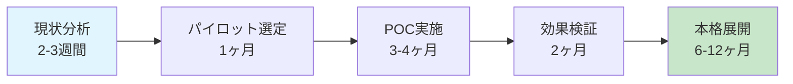

---

<!-- _class: manufacturing-theme lead -->

# 製造業における生成AI活用の最新動向と成功事例

## 🏭 Digital Transformation 2024

### 生産性革命への道筋

2024年8月 | 製造業DXセミナー

---

# 📋 本日のアジェンダ

## 1. 製造業を取り巻く環境変化
## 2. 生成AI技術の製造業への応用
## 3. 具体的な成功事例分析
## 4. 導入戦略とロードマップ
## 5. 質疑応答・次のステップ

---

# 🔍 製造業の現状と課題

  
38%

  
熟練工不足

  
2.3%

  
平均不良率

  
¥2.8M

  
月間品質コスト

💡 <strong>急務の課題</strong>: 技術継承、品質向上、コスト削減の同時解決

> 📊 **出典**: 製造業労働実態調査2024（経済産業省）

---

# 🚀 生成AIが製造業にもたらす変革

## 従来の自動化 vs 生成AI

### 👈 従来の自動化
- ❌ ルールベース処理
- ❌ 定型作業のみ対応
- ❌ 例外処理が困難
- ❌ 設定変更に専門知識必要

### 👉 生成AI活用
- ✅ 学習ベース処理
- ✅ 複雑な判断も自動化
- ✅ 例外も柔軟に対応
- ✅ 継続的な性能向上

---

# 📈 製造業AI導入の現状

  
67%

  
AI導入検討中

  
23%

  
既に導入済み

  
34%

  
ROI改善実感

## 主要適用領域

| 領域 | 導入率 | 期待効果 |
|---|---|---|
| **品質検査** | 42% | 不良率50%削減 |
| **予測保全** | 31% | 設備稼働率15%向上 |
| **生産計画** | 28% | リードタイム30%短縮 |

---

# 🏆 成功事例1: 大手自動車部品メーカーA社

## AI画像検査システム導入

### 👈 導入前
- ❌ 不良率: **3.2%**
- ❌ 検査時間: **45分/ロット**
- ❌ 人員: **4名体制**
- ❌ 年間損失: **¥85M**

### 👉 導入後
- ✅ 不良率: **0.1%**
- ✅ 検査時間: **5分/ロット**
- ✅ 人員: **1名体制**
- ✅ 年間削減: **¥120M**

💰 <strong>ROI</strong>: 投資回収期間 <strong>14ヶ月</strong> | 年間削減効果 <strong>¥120M</strong>

---

# 🔧 技術詳細: AI画像検査システム

## システムアーキテクチャ

| コンポーネント | 技術 | 役割 |
|---|---|---|
| **画像取得** | 高解像度カメラ×4台 | 全方位撮影 |
| **前処理** | OpenCV + 独自アルゴリズム | ノイズ除去・正規化 |
| **AI判定** | CNN + Vision Transformer | 欠陥検出・分類 |
| **結果出力** | REST API | MES連携 |

### 🎯 検出可能な欠陥タイプ
- **表面キズ**（0.1mm以上）
- **寸法誤差**（±0.05mm）
- **色むら・変色**
- **異物混入**

---

# 🏆 成功事例2: 電子部品製造B社

## 予測保全システム

### 効果指標

設備稼働率向上: 85% → 96%

計画外停止削減: 68%

保全コスト削減: 42%

### 主要機能
- **リアルタイム異常検知**: 振動・温度・音響データ分析
- **故障予測**: 30日前の故障予測精度89%
- **最適保全タイミング**: コスト最小化スケジューリング

---

# 🏆 成功事例3: 化学プラントC社

## プロセス最適化AI

### 導入効果

  
15%

  
エネルギー削減

  
22%

  
収率向上

  
¥180M

  
年間コスト削減

### AI活用領域
- **プロセス条件最適化**: 温度、圧力、流量の自動調整
- **品質予測**: 製品品質のリアルタイム予測
- **安全性監視**: 異常状態の早期検知・警告

---

# 📊 導入効果の業界比較

## ROI実現期間

| 業界 | 平均投資額 | 回収期間 | 年間効果額 |
|---|---|---|---|
| **自動車** | ¥25M | 16ヶ月 | ¥45M |
| **電子機器** | ¥18M | 14ヶ月 | ¥32M |
| **化学** | ¥35M | 20ヶ月 | ¥58M |
| **食品** | ¥12M | 12ヶ月 | ¥18M |

📈 <strong>平均ROI</strong>: 投資から18ヶ月で投資額回収、その後年間150-200%のリターン

---

# 🛣️ 導入ロードマップ

## 段階的アプローチ

### Phase 1: 基盤構築（3-6ヶ月）
- データ収集・整備
- 基本的なAIモデル構築
- 小規模テスト運用

### Phase 2: 拡張展開（6-12ヶ月）
- 対象工程の拡大
- 精度向上・機能追加
- 全社システム連携

---

# ⚠️ 導入時の注意点とリスク対策

## 主要リスクと対策

### 🚨 技術的リスク
- **データ品質問題**
  → データクレンジング強化
- **AIモデル精度不足**
  → 段階的学習・継続改善
- **システム統合課題**
  → API設計・段階移行

### 👥 組織的リスク
- **現場の抵抗感**
  → 充分な説明・教育
- **スキル不足**
  → 外部専門家活用
- **運用体制不備**
  → 専任チーム設置

🔑 <strong>成功の鍵</strong>: 経営層のコミット × 現場の理解 × 技術パートナーとの協働

---

# 💡 2024年注目技術トレンド

## 次世代製造AI技術

### 🔮 生成AI × 製造業の新展開

| 技術 | 応用例 | 期待効果 |
|---|---|---|
| **LLM活用** | 作業手順書自動生成 | 文書作成工数50%削減 |
| **画像生成AI** | 設計案自動生成 | 開発期間30%短縮 |
| **音声AI** | 現場音声コマンド | 作業効率15%向上 |
| **マルチモーダルAI** | 総合品質判定 | 判定精度95%以上 |

### 🌟 注目キーワード
- **Edge AI**: リアルタイム処理の高速化
- **Explainable AI**: 判断根拠の可視化
- **Federated Learning**: プライバシー保護学習

---

# 💬 よくある質問

<strong>Q: 導入コストはどの程度？</strong> 
A: 規模により異なりますが、中規模ライン（月産10万個）で約¥15-25M。
ROI期間は通常18-24ヶ月です。

<strong>Q: 既存システムとの連携は？</strong> 
A: MES、ERP、SCMシステムとの標準API連携を提供。
段階的移行により業務停止リスクを最小化します。

<strong>Q: 保守・運用体制は？</strong> 
A: 24時間監視体制、定期メンテナンス、継続的な学習データ更新を
包括的にサポートします。

---

# 🚀 次のアクション

## まずは無料診断から始めませんか？

### 📋 無料工場診断サービス
- **現状分析レポート**
- **AI適用可能性評価**  
- **ROI概算シミュレーション**
- **カスタム提案書**

**所要時間**: 半日 | **費用**: 完全無料

### 📞 お問い合わせ
**AI導入推進チーム**: ai-consulting@company.com  
**直通**: 03-XXXX-XXXX

---

<!-- _class: manufacturing-theme lead -->

# ありがとうございました

## 🏭 製造業の未来を、AIと共に

### 質疑応答の時間

製造業DX推進チーム 
contact@ai-manufacturing.jp

